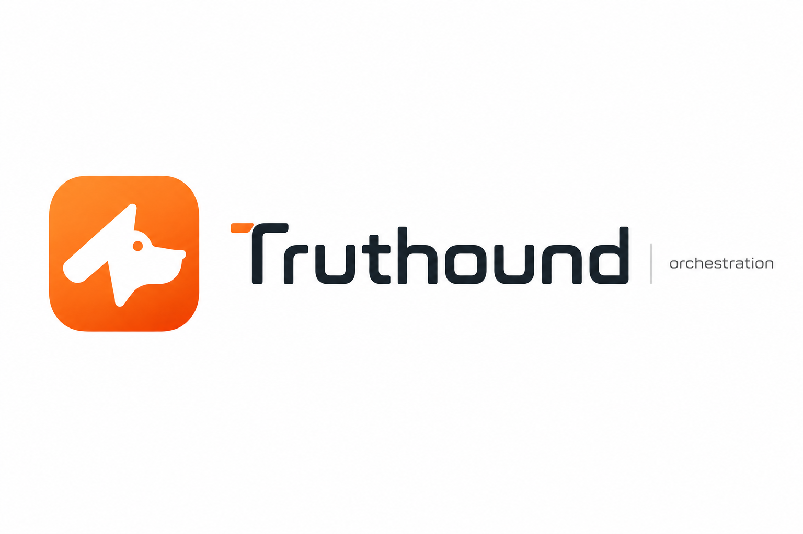

<div align="center">
  
</div>

<h1 align="center">Truthound Orchestration — Data Quality Workflow</h1>

<p align="center">
  <strong>Truthound 데이터 품질 검증을 워크플로우 오케스트레이션 환경에서 실행하기 위한 공식 통합 레이어</strong> <br/>
  <strong>Official Workflow Orchestration Integrations for Truthound Data Quality</strong>
</p>

<p align="center">
  <em>Run Truthound quality checks where your pipelines already live.</em>
</p>

<p align="center">
  <a href="https://truthound.netlify.app/orchestration/"></a>
  <a href="https://pypi.org/project/truthound-orchestration/"></a>
  <a href="https://www.python.org/downloads/"></a>
  <a href="https://opensource.org/licenses/Apache-2.0"></a>
  <a href="https://github.com/astral-sh/ruff"></a>
  <a href="https://pepy.tech/project/truthound-orchestration">
    
  </a>
</p>

<!--
README HEADER FORMAT LOCK:
The exact header format above MUST be preserved.
Do not rewrite it as Markdown-only syntax, do not remove the centered HTML,
do not change the banner image block, title, bilingual subtitle, slogan, or
badge block, and do not reorder those elements.
This required format starts at:
  <div align="center">
and ends at the closing </p> of the badge block above.
-->

---

## 개요 (Overview)

**Truthound Orchestration**은 [Truthound](https://github.com/seadonggyun4/truthound) 데이터 품질 검증을 Airflow, Dagster, Prefect, dbt, Mage, Kestra 등 주요 워크플로우 오케스트레이션 환경에서 그대로 실행할 수 있도록 하는 공식(first-party) 통합 레이어입니다.

Truthound Orchestration provides the official orchestration integrations for running Truthound data quality checks across major workflow platforms.

**English Readme**: [English README](README.en.md) <br/>
**문서 (Documentation)**: [truthound.netlify.app/orchestration](https://truthound.netlify.app/orchestration/)

---

## 개발 목적 (Motivation)

데이터 품질 검증은 배치, 모델 학습, 리포팅, 데이터 제품 운영 등 실제 파이프라인 안에서 반복적으로 실행되어야 합니다. 하지만 오케스트레이션 도구마다 실행 방식, 결과 전달 방식, 재시도와 알림 방식이 달라 품질 검증 로직이 쉽게 흩어집니다.

Truthound Orchestration은 Truthound의 검증 의미와 결과 계약을 유지하면서, 각 워크플로우 플랫폼의 네이티브 패턴으로 데이터 품질 검사를 실행할 수 있도록 표준 통합 계층을 제공합니다.

---

## 프로젝트 소개 (Introduction)

Truthound Orchestration은 Truthound 3.x를 위한 오픈소스 워크플로우 통합 프로젝트입니다. Airflow Operator, Dagster Resource/Op, Prefect Block/Task, dbt macro, Mage block, Kestra script/template 등을 통해 데이터 품질 검증을 기존 파이프라인에 자연스럽게 연결합니다.

이 프로젝트는 Truthound의 검증 커널을 대체하지 않습니다. Truthound가 데이터 품질 검증과 결과 모델을 담당하고, Truthound Orchestration은 그 검증을 스케줄러와 워크플로우 시스템 안에서 실행·전달·관측할 수 있도록 돕습니다.

| 구성 요소 | 저장소 | 역할 |
| --- | --- | --- |
| **Truthound** | [`truthound`](https://github.com/seadonggyun4/truthound) | 데이터 품질 검증 커널, `th.check()`, `ValidationRunResult`, 리포터, 체크포인트 |
| **Truthound Orchestration** | [`truthound-orchestration`](https://github.com/seadonggyun4/truthound-orchestration) | Airflow, Dagster, Prefect, dbt, Mage, Kestra 등 워크플로우 환경 연동 레이어 |

---

## 기대 효과 (Impact)

Truthound Orchestration을 사용하면 데이터 품질 검사를 파이프라인의 독립 스크립트가 아니라 운영 워크플로우의 일부로 다룰 수 있습니다. 팀은 동일한 Truthound 결과 계약을 유지하면서도 각 플랫폼의 재시도, 알림, 아티팩트, 메타데이터, 스케줄링 기능을 활용할 수 있습니다.

이를 통해 ETL/ELT, 분석 리포팅, AI/ML 학습 전 검증, 운영 데이터 동기화 같은 반복 작업에서 데이터 품질 게이트를 더 일관되게 배치할 수 있습니다.

---

## 주요 특징 (Key Features)

- **Truthound 3.x 공식 통합**: `truthound>=3.0,<4.0` 결과 계약을 기준으로 동작합니다.
- **플랫폼 네이티브 실행**: Airflow, Dagster, Prefect, dbt, Mage, Kestra의 관용적 실행 모델을 따릅니다.
- **단일 결과 의미**: 플랫폼이 달라도 Truthound의 검증 결과 의미를 유지합니다.
- **Protocol 기반 구조**: 고급 사용자를 위해 대체 엔진과 커스텀 엔진 주입 지점을 제공합니다.
- **품질 워크플로우 자동화**: 검증, 프로파일링, 스키마 학습, 드리프트 탐지, 이상치 탐지를 파이프라인 단계로 연결합니다.
- **운영 친화적 표면**: 직렬화, 로깅, 재시도, 서킷 브레이커, 헬스 체크, 메트릭 유틸리티를 제공합니다.

> AI/ML 파이프라인에서도 학습 전 입력 데이터 검증, 피처 테이블 품질 게이트, 드리프트 감지 단계로 활용할 수 있습니다. 다만 이 프로젝트의 핵심은 AI 제품이 아니라 Truthound 데이터 품질 워크플로우를 오케스트레이션 환경에 안정적으로 연결하는 것입니다.

---

## 지원 플랫폼 (Supported Platforms)

| 플랫폼 | 패키지/모듈 | 주요 역할 |
| --- | --- | --- |
| Apache Airflow | `truthound_airflow` | Operator, Sensor, Hook 기반 데이터 품질 검증 |
| Dagster | `truthound_dagster` | Resource, Asset, Op 기반 검증 워크플로우 |
| Prefect | `truthound_prefect` | Block, Task, Flow 기반 품질 파이프라인 |
| dbt | `packages/dbt` | Generic Test, Jinja macro, SQL 기반 검증 |
| Mage AI | `packages/mage` | Transformer, Sensor, Condition block |
| Kestra | `packages/kestra` | Python script, YAML flow template, output handler |

---

## 빠른 시작 (Quick Start)

### 설치 (Installation)

```bash
# 코어 패키지 + Truthound 3.x
pip install truthound-orchestration "truthound>=3.0,<4.0"
```

```bash
# 플랫폼별 통합 + Truthound 3.x
pip install truthound-orchestration[airflow] "truthound>=3.0,<4.0"
pip install truthound-orchestration[dagster] "truthound>=3.0,<4.0"
pip install truthound-orchestration[prefect] "truthound>=3.0,<4.0"
```

```bash
# 로컬 실험 또는 야간 카나리용 편의 집계
pip install truthound-orchestration[all] "truthound>=3.0,<4.0"
```

### Python API

```python
from common.engines import TruthoundEngine
import polars as pl

engine = TruthoundEngine()
df = pl.read_csv("data.csv")

with engine:
    result = engine.check(df, auto_schema=True)
    print(f"Status: {result.status.name}")
```

이 기본 예제는 Truthound 3.x의 zero-config 자동 검증 경로만 사용하므로 위의
기본 설치 명령만으로 실행할 수 있습니다. 드리프트·이상치 탐지처럼 선택 의존성이
필요한 작업은 해당 기능 문서의 설치 안내를 먼저 확인하세요.

### Airflow 예시

```python
from airflow import DAG
from airflow.utils.dates import days_ago
from truthound_airflow import DataQualityCheckOperator

with DAG(
    dag_id="data_quality_pipeline",
    start_date=days_ago(1),
    schedule_interval="@daily",
) as dag:
    validate_data = DataQualityCheckOperator(
        task_id="validate_user_data",
        data_path="/opt/airflow/data/users.parquet",
        fail_on_error=True,
    )
```

기본 `TruthoundEngine`은 `rules`를 생략하면 Truthound 3.x의 zero-config 자동
스키마 검증을 실행합니다. `rules=[{"type": ...}]` 형식은 이를 직접 해석하는
대체 엔진용 공통 계약이며, 현재 Truthound 어댑터가 해당 사전을 Truthound
검증기로 변환하는 공개 표면은 아닙니다.

---

## Truthound 3.x 호환성 (Compatibility)

`truthound-orchestration` `3.x`는 `Truthound 3.x`만 지원합니다.

- 지원 Truthound 버전: `>=3.0,<4.0`
- 미지원 Truthound 버전: `1.x`, `2.x`
- 이 정책은 루트 패키지와 공식 플랫폼 extra에 적용됩니다.
- 이전 Truthound 엔진 라인이 필요하면 이전 `truthound-orchestration` 릴리스 라인을 사용하세요.

---

## 아키텍처 (Architecture)

Truthound Orchestration은 공통 Protocol 계층과 플랫폼별 어댑터 계층으로 구성됩니다. Truthound가 기본 검증 런타임이며, 고급 사용자는 Protocol을 구현해 커스텀 엔진을 연결할 수 있습니다.

```text
Workflow Platforms
Airflow / Dagster / Prefect / dbt / Mage / Kestra
        |
        v
Truthound Orchestration Common Layer
Protocols / Config / Serializers / Logging / Retry / Metrics
        |
        v
Truthound Engine
Validation / Profiling / Learn / Drift / Anomaly / Streaming
```

---

## 고급 엔진 지원 (Advanced Engine Support)

대체·커스텀 엔진은 고급 사용 사례를 위해 계속 제공되지만, `3.x` 릴리스 라인의 기본 호환성 경로는 Truthound 3.x입니다.

```bash
# Great Expectations adapter
pip install truthound-orchestration[dagster] great-expectations

# Pandera adapter
pip install truthound-orchestration[airflow,prefect] pandera
```

지원되는 고급 엔진 옵션:

- [Great Expectations](https://greatexpectations.io/) 어댑터
- [Pandera](https://pandera.readthedocs.io/) 어댑터
- `DataQualityEngine` Protocol을 구현한 커스텀 엔진

---

## 문서 (Documentation)

- 메인 문서 포털: [truthound.netlify.app/orchestration](https://truthound.netlify.app/orchestration/)
- 아키텍처: [docs/architecture.md](docs/architecture.md)
- 플랫폼 선택 가이드: [docs/choose-a-platform.md](docs/choose-a-platform.md)
- Airflow 문서: [docs/airflow/index.md](docs/airflow/index.md)
- Dagster 문서: [docs/dagster/index.md](docs/dagster/index.md)
- Prefect 문서: [docs/prefect/index.md](docs/prefect/index.md)
- dbt 문서: [docs/dbt/index.md](docs/dbt/index.md)
- Mage 문서: [docs/mage/index.md](docs/mage/index.md)
- Kestra 문서: [docs/kestra/index.md](docs/kestra/index.md)
- 공통 모듈 문서: [docs/common/index.md](docs/common/index.md)
- 릴리스 가이드: [docs/releasing.md](docs/releasing.md)

---

## 개발 (Development)

```bash
git clone https://github.com/seadonggyun4/truthound-orchestration.git
cd truthound-orchestration

uv venv
source .venv/bin/activate
uv sync --all-extras
```

```bash
# lint
ruff check .

# type check
mypy common/

# tests
PYTHONPATH=. pytest --import-mode=importlib
```

---

## 라이선스 (License)

Apache License 2.0. 자세한 내용은 [LICENSE](LICENSE)를 참고하세요.
