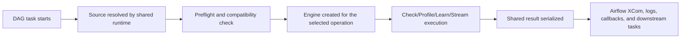

# Airflow

Airflow is the best fit when Truthound validation needs to live inside scheduled DAGs, gate downstream tasks, or reuse existing Airflow connection and alerting patterns.

The Airflow package follows provider-style boundaries: operators, sensors, hooks, and SLA callbacks stay Airflow-native, while engine resolution, source normalization, and preflight behavior stay in the shared runtime.

## Who This Is For

- you already operate DAG-based pipelines
- you want quality checks to behave like first-class Airflow tasks
- you need sensor-based gating before downstream work continues
- you want connection-backed SQL sources but still keep local-path onboarding simple

## When To Use It

Use Airflow when:

- the quality boundary naturally belongs in a DAG
- downstream work must block, branch, or alert based on validation results
- existing Airflow connections and alerting policies should remain the operational control plane
- the team wants operators, hooks, and sensors instead of a new orchestration abstraction

Prefer Dagster for asset-graph-first work, Prefect for Python-first flows with persisted blocks, and dbt for warehouse-native test execution.

## Prerequisites

- `truthound-orchestration[airflow]` installed in the Airflow runtime
- a supported Airflow/Python tuple from the compatibility matrix
- either a local/remote data path or an Airflow connection for SQL-backed checks

## Minimal Quickstart

Install the supported Airflow surface:

```bash
pip install truthound-orchestration[airflow] "truthound>=3.0,<4.0"
```

Then create a basic operator:

```python
from airflow import DAG
from truthound_airflow import DataQualityCheckOperator

with DAG("quality_pipeline", schedule="@daily", catchup=False) as dag:
    check_users = DataQualityCheckOperator(
        task_id="check_users",
        data_path="/opt/airflow/data/users.parquet",
        rules=[
            {"column": "user_id", "type": "not_null"},
            {"column": "email", "type": "unique"},
        ],
    )
```

Add a sensor when a later task should wait on a quality threshold:

```python
from truthound_airflow import DeferrableDataQualitySensor

wait_for_users = DeferrableDataQualitySensor(
    task_id="wait_for_users_quality",
    data_path="/opt/airflow/data/users.parquet",
    rules=[{"column": "id", "check": "not_null"}],
)
```

## Decision Table

| Need | Recommended Airflow Surface | Why |
|------|-----------------------------|-----|
| run a hard quality gate inside a DAG | `DataQualityCheckOperator` | behaves like a normal task failure boundary |
| wait until a quality condition becomes true | `DataQualitySensor` or `DeferrableDataQualitySensor` | keeps gating host-native |
| execute connection-aware loads | `DataQualityHook` | preserves Airflow connection patterns |
| emit threshold-based notifications | SLA callbacks | keeps alert routing separate from task logic |
| move large data through bounded-memory validation | `DataQualityStreamOperator` | avoids loading everything into memory |

## Execution Lifecycle



## Result Surface

- check tasks push shared Truthound results into Airflow-native transport layers such as XCom
- the default check XCom key is `data_quality_result`
- sensors and callbacks should consume the documented serialized payload instead of reconstructing status from logs alone
- downstream tasks can read the same canonical status, count, and metadata fields used in the other adapters

## Config Surface

| Config Area | Airflow Boundary |
|-------------|------------------|
| source location | `data_path=` or `sql=` on the operator/sensor |
| credentials | `connection_id=` and Airflow connection metadata |
| execution engine | `engine_name=` or the default Truthound path |
| timeout and strictness | operator config such as `timeout_seconds` and operation-specific settings |
| result transport | `xcom_push_key=` and callback wiring |

## What Zero-Config Covers

- local file paths do not need an Airflow connection
- Truthound remains the default engine
- omitted persistence stays ephemeral
- shared preflight still runs before execution

What it does **not** cover:

- SQL execution without an Airflow connection
- secret discovery outside standard Airflow patterns
- persistent Truthound workspace behavior unless you configure it explicitly

## Primary Components

| Component | Use It For |
|-----------|------------|
| `DataQualityCheckOperator` | row-level validation and pass/fail gating |
| `DataQualityProfileOperator` | profiling and shape inspection |
| `DataQualityLearnOperator` | learning rules from baseline data |
| `DataQualityStreamOperator` | bounded-memory streaming checks |
| `DataQualitySensor` / `DeferrableDataQualitySensor` | waiting for a quality threshold before continuing |
| `DataQualityHook` / `TruthoundHook` | source loading and connection-aware execution |
| SLA callbacks and monitors | warning, escalation, and alert routing |

## Production Pattern

- Use operators for execution and hooks for source or connection concerns.
- Prefer deferrable or reschedule-friendly patterns for long waits.
- Keep XCom payload handling on the shared result contract instead of ad hoc serialization.
- Treat local files as the onboarding path and connections as the production path.
- Keep alerting in callbacks instead of duplicating it in every downstream task.

## Production Checklist

- pin a supported Airflow/Python tuple from the compatibility matrix
- confirm whether the source path requires an Airflow connection
- use shared rule modules for repeated DAG patterns
- choose explicit XCom keys when downstream tasks rely on them
- use deferrable sensors for long waits
- wire alerting through callbacks or SLA monitors before going live

## Failure Modes and Troubleshooting

| Symptom | Likely Cause | What To Do |
|--------|--------------|------------|
| SQL checks fail while file checks pass | missing or incorrect `connection_id` | verify the Airflow connection and secret source |
| downstream tasks cannot find the result | custom `xcom_push_key` differs from the consumer expectation | align the key across producer and consumer |
| sensor ties up workers | active waiting in a long-running quality gate | switch to the deferrable sensor where available |
| alerting is inconsistent across DAGs | callbacks are configured ad hoc | centralize callback chains and reuse them |

## Read Next

- [Install and Compatibility](install-compatibility.md)
- [Connections and Secrets](connections-secrets.md)
- [DAG Patterns](dag-patterns.md)
- [Operators](operators.md)
- [Hooks](hooks.md)
- [Sensors and Triggers](sensors.md)
- [XCom and Result Payloads](xcom-result-payloads.md)
- [SLA and Callbacks](sla.md)
- [Observability and Alerting](observability-alerting.md)
- [Recipes](recipes.md)
- [Troubleshooting](troubleshooting.md)
