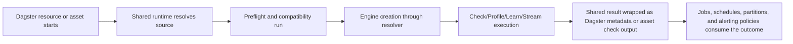

# Dagster

Dagster is the best fit when Truthound quality logic should feel like part of your asset graph rather than a separate orchestration layer. The integration is centered on `ConfigurableResource`, ops, and asset helpers that preserve Dagster-native structure while reusing the shared runtime.

## Who This Is For

- quality checks can sit next to assets and asset checks
- results can flow into Dagster-native metadata
- resource configuration gives a clean place to define engine behavior
- the same resource can power check, profile, learn, and streaming patterns

## When To Use It

Use Dagster when:

- quality should be expressed as part of the asset graph
- metadata-rich checks matter as much as pass/fail status
- teams want resource-scoped engine configuration with strong code locality
- jobs, schedules, partitions, and automation policies should remain Dagster-native

## Prerequisites

- `truthound-orchestration[dagster]` installed
- a supported Dagster and Python compatibility tuple
- a Dagster project using Definitions, resources, ops, or assets

## Minimal Quickstart

Install the supported Dagster surface:

```bash
pip install truthound-orchestration[dagster] "truthound>=3.0,<4.0"
```

Then wire the default resource:

```python
from dagster import Definitions, asset
from truthound_dagster.resources import DataQualityResource

@asset
def validated_users(data_quality: DataQualityResource):
    return data_quality.check(
        load_users(),
        rules=[{"column": "user_id", "type": "not_null"}],
    )

defs = Definitions(resources={"data_quality": DataQualityResource()})
```

`DataQualityResource()` with no arguments is the canonical default.

Add asset-level quality semantics when the validation should travel with the asset:

```python
from truthound_dagster import quality_checked_asset

@quality_checked_asset(
    rules=[{"column": "user_id", "check": "not_null"}],
)
def users():
    return load_users()
```

## Decision Table

| Need | Recommended Dagster Surface | Why |
|------|-----------------------------|-----|
| central engine and preflight control | `DataQualityResource` | resource lifecycle stays explicit |
| reusable graph step | prebuilt ops or `create_check_op` | keeps jobs composable |
| asset-native quality boundary | `quality_checked_asset` or `quality_asset_check` | matches Dagster's asset model |
| SLA policy enforcement | `SLAResource` and hooks | separates evaluation from graph code |

## Execution Lifecycle



## Result Surface

- shared Truthound results remain the canonical status and count contract
- Dagster metadata wrappers make those results readable in the UI
- asset checks should expose dataset, partition, and failure context without redefining result meaning

## Config Surface

| Config Area | Dagster Boundary |
|-------------|------------------|
| engine selection | `DataQualityResource` and resource config |
| operation rules | op factories, asset decorators, or direct resource calls |
| metadata wrapping | `to_dagster_metadata` and asset check helpers |
| SLA policy | `SLAResource`, hooks, and thresholds |
| scheduling/automation | Dagster jobs, schedules, partitions, and automation rules |

## What The Resource Buys You

- one place to configure engine selection, timeout, failure policy, and observability
- shared runtime preflight before real execution
- helper methods for `check`, `profile`, `learn`, and `stream_check`
- alignment with Dagster resource lifecycle hooks

## Primary Surfaces

| Surface | Use It For |
|---------|------------|
| `DataQualityResource` | resource-first integration and direct execution |
| prebuilt ops | operation-level composition in jobs |
| asset decorators and factories | quality-aware assets and asset checks |
| SLA helpers | enforcing operational thresholds around quality runs |

## Production Pattern

- resource setup uses the shared resolver
- preflight runs before engine creation proceeds
- Dagster metadata stays Dagster-native
- result semantics stay shared with the rest of the repository

## Production Checklist

- keep engine defaults and overrides on the resource, not spread across jobs
- separate exploratory profile or learn runs from steady-state checks
- include partition context in asset-level alerts and metadata
- standardize whether warnings fail jobs or remain informational
- document which jobs own remediation and which only report

## Failure Modes and Troubleshooting

| Symptom | Likely Cause | What To Do |
|--------|--------------|------------|
| asset metadata is rich but hard to automate | only display metadata is consumed | preserve the shared result alongside Dagster metadata |
| quality logic is duplicated across assets | every asset redefines checks inline | move common rules into helpers or factories |
| partition failures are noisy | whole-asset jobs own partition-local checks | push validation closer to the partition boundary |
| operators cannot tell if a failure is config or data | preflight and runtime failures are mixed together | expose preflight outcomes before treating the run as data quality noise |

## Read Next

- [Install and Compatibility](install-compatibility.md)
- [Jobs and Schedules](jobs-schedules.md)
- [Partitions and Automation](partitions-automation.md)
- [Resources](resources.md)
- [Ops](ops.md)
- [Assets and Asset Checks](assets.md)
- [Metadata and Result Payloads](metadata-results.md)
- [SLA and Hooks](sla-hooks.md)
- [Alerting and Automation](alerting-automation.md)
- [Recipes](recipes.md)
- [Troubleshooting](troubleshooting.md)
