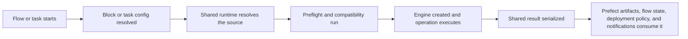

# Prefect

Prefect is the best fit when your team wants Python-first workflows with an optional persisted configuration boundary. Blocks handle reusable configuration, while tasks and flows handle execution ergonomics.

## Who This Is For

- flows stay readable Python
- saved blocks make it easy to share configuration across deployments
- ephemeral paths still exist for fast local onboarding
- task helpers provide a smooth path from one-off checks to reusable flow factories

## When To Use It

Use Prefect when:

- a team prefers Python-native orchestration over DAG or asset graphs
- the same quality logic should run both locally and in managed deployments
- configuration should start ephemeral and later move into saved blocks
- retries, caching, concurrency, and deployments should stay in Prefect's control plane

## Prerequisites

- `truthound-orchestration[prefect]` installed
- a supported Prefect/Python tuple
- a data source shape supported by the shared runtime

## Minimal Quickstart

Install the supported Prefect surface:

```bash
pip install truthound-orchestration[prefect] "truthound>=3.0,<4.0"
```

Then start with an ephemeral task-based flow:

```python
from prefect import flow
from truthound_prefect.tasks import data_quality_check_task

@flow
async def validate_users(data):
    return await data_quality_check_task(
        data,
        rules=[{"column": "id", "type": "not_null"}],
    )
```

If you omit a block, Prefect creates an in-memory Truthound-backed block for the run.

Use a reusable flow factory when the pattern should be shared:

```python
from truthound_prefect import QualityFlowConfig, create_quality_flow

quality_flow = create_quality_flow(
    "users_quality",
    cfg=QualityFlowConfig(
        rules=[{"column": "id", "check": "not_null"}],
        engine_name="truthound",
    ),
)
```

## Saved Block Path

Use a saved block when the configuration should outlive one run:

```python
from truthound_prefect.blocks import DataQualityBlock

block = DataQualityBlock(engine_name="truthound")
```

## Decision Table

| Need | Recommended Prefect Surface | Why |
|------|-----------------------------|-----|
| quick in-code validation | task helpers | fastest path for ephemeral flows |
| shared configuration | `DataQualityBlock` | persisted configuration boundary |
| reusable orchestration pattern | `create_quality_flow` or decorators | consistent rollout across teams |
| reporting in the Prefect UI | artifact helpers | keeps output readable without redefining the result |
| operational thresholds | SLA helpers | separates alert policy from flow code |

## Execution Lifecycle



## Result Surface

- shared Truthound results remain the canonical machine-readable output
- Prefect-facing helpers such as `to_prefect_artifact` turn those results into UI-friendly artifacts
- flow state alone is not enough for warning-heavy quality operations; use the result payload too

## Config Surface

| Config Area | Prefect Boundary |
|-------------|------------------|
| engine and runtime config | `DataQualityBlock` or flow config |
| retries and caching | task or flow config |
| deployment routing | Prefect deployment, work pool, and worker settings |
| output presentation | artifact helpers and downstream flow code |
| SLA policy | SLA blocks and hooks |

## Primary Surfaces

| Surface | Use It For |
|---------|------------|
| `DataQualityBlock` | persisted configuration and direct block-level execution |
| task helpers | ad hoc flow composition |
| flow decorators and factories | repeatable workflow patterns |
| SLA helpers | thresholds and alert routing |

## Production Pattern

- start with task helpers for proof-of-value flows
- move stable configuration into a saved `DataQualityBlock`
- use flow factories once more than one pipeline shares the pattern
- make retries and caching explicit instead of relying on default behavior

## Production Checklist

- choose whether the flow is ephemeral, block-backed, or deployment-first
- define retry and cache policy for each operation type
- document which environment owns each saved block
- publish artifacts or summaries for operators before broad rollout

## Failure Modes and Troubleshooting

| Symptom | Likely Cause | What To Do |
|--------|--------------|------------|
| local flow works but deployed flow differs | configuration drift between code and deployment | move stable config into blocks and versioned flow factories |
| failures retry endlessly | data-quality failures are being treated as transient transport issues | narrow retries to infrastructure failures |
| operators cannot see warning context | flow state alone is being inspected | publish structured artifacts or summaries |

## Read Next

- [Install and Compatibility](install-compatibility.md)
- [Blocks](blocks.md)
- [Tasks](tasks.md)
- [Flows](flows.md)
- [Artifacts and Result Payloads](artifacts-results.md)
- [Retries, Caching, and Concurrency](retries-caching-concurrency.md)
- [SLA and Hooks](sla.md)
- [Work Pools and Workers](work-pools-workers.md)
- [Deployment Patterns](deployment-patterns.md)
- [Rollout Playbooks](rollout-playbooks.md)
- [Troubleshooting](troubleshooting.md)
