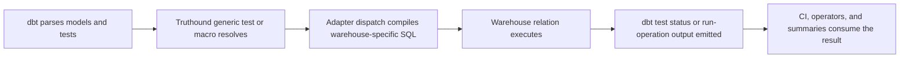

!!! note "Truthound Orchestration 한국어 문서"
    이 페이지는 Truthound 문서의 한국어 미러입니다. 코드, 명령어, API 이름은 정확성을 위해 원문 표기를 유지하고, 설명은 데이터 품질 워크플로우 관점으로 제공합니다.

---
title: dbt Overview
---

# Truthound — Data Quality 워크플로우 for dbt

Truthound's dbt package is the SQL-first member of the `truthound-오케스트레이션 3.x`
family. It keeps the authoring model native to dbt: generic tests in `schema.yml`,
adapter-dispatched SQL, and `run-operation` entry points for ad hoc 검증 and
summary 워크플로우s.

## Who This Is For

- dbt teams that want first-party 데이터 품질 rules without introducing a second
  오케스트레이션 runtime inside the project
- analytics engineers who prefer declarative YAML tests over Python task code
- platform operators who need repeatable CI 검증 across warehouses

## When To Use The dbt Adapter

Use the dbt package when:

- your 검증 boundary is already model- or source-centric
- you want dbt-native test failures and warnings in CI
- you need warehouse-aware SQL generation through `adapter.dispatch`
- you want to keep Truthound rule vocabulary aligned with the other 오케스트레이션
  adapters in this repository

Prefer Airflow, Dagster, or Prefect when you need multi-step 오케스트레이션, external
task retries, scheduling, or cross-system alert routing outside dbt itself.

## Prerequisites

- `dbt-core` installed with a supported adapter
- Truthound added to `packages.yml` and fetched with `dbt deps`
- a working dbt target and relation-backed models or sources

## What The Package Provides

- package-qualified generic tests such as `truthound.truthound_check`
- convenience column tests such as `truthound.truthound_not_null`
- macros for summary and profile style execution
- warehouse-specific SQL behavior routed through adapter dispatch
- first-party compile and execution fixtures used in CI

## Minimal Quickstart

1. Add the package to `packages.yml`.
2. Run `dbt deps`.
3. Attach Truthound tests to a model or source.
4. Run `dbt test`.

```yaml
# packages.yml
packages:
  - package: truthound/truthound
    version: ">=3.0.3,<4.0.0"
```

```yaml
# models/marts/schema.yml
version: 2

models:
  - name: dim_users
    tests:
      - truthound.truthound_check:
          arguments:
            rules:
              - column: id
                check: not_null
              - column: id
                check: unique
              - column: email
                check: email_format
              - column: status
                check: in_set
                values: ["active", "inactive", "pending"]
```

Use `run-operation` when you need an ad hoc smoke or summary path:

```bash
dbt run-operation run_truthound_check --args '{
  "model_name": "test_model_valid",
  "rules": [{"column": "id", "check": "not_null"}],
  "options": {"limit": 50}
}'
```

## Decision Table

| Need | Recommended dbt Surface | Why |
|------|-------------------------|-----|
| grouped model contract | `truthound.truthound_check` | expressive and package-native |
| simple column rule | convenience tests such as `truthound.truthound_not_null` | compact YAML |
| ad hoc operator summary | `run_truthound_summary` | human-readable diagnostics |
| CI parity checking | first-party suite | validates both compile and execute lanes |

## Execution Lifecycle



## Result Surface

- `dbt test` remains the canonical pass/fail surface
- `run_truthound_check` and `run_truthound_summary` provide targeted smoke and summary output
- the adapter is relation-based, so results describe warehouse execution rather than local DataFrame execution

## Config Surface

| Config Area | dbt Boundary |
|-------------|--------------|
| package installation | `packages.yml` and `dbt deps` |
| 검증 intent | `schema.yml` generic tests and rule lists |
| runtime target | dbt profiles and targets |
| ad hoc execution | `run-operation` macros |
| severity | dbt test config such as `severity: warn` |

## Production Pattern

The most reliable production layout is:

- package-qualified test names everywhere
- model-level `truthound_check` for grouped quality gates
- column-level convenience tests for obvious constraints
- `severity: warn` only for known-bad fixtures, migration windows, or soft rollout
- CI that runs both `dbt test` and targeted `run-operation` smoke checks

## Data Shapes And Rule Semantics

The dbt adapter works on compiled SQL relations, so it is best suited for:

- dbt models
- dbt sources
- warehouse tables and views referenced by `ref()` and `source()`

Unlike the Python adapters, dbt does not resolve local file paths or in-memory
dataframes at runtime. The 검증 target is always the relation produced by dbt.

## What Is Shared With The Other Adapters

The dbt package uses the same Truthound rule vocabulary as the Python 오케스트레이션
adapters. That means a team can keep the same high-level quality intent while choosing
different execution hosts for different pipelines.

For cross-cutting runtime behavior, see:

- [Shared Runtime Overview](../common/index.md)
- [Preflight and Compatibility](../common/preflight-compatibility.md)
- [Result Serialization](../common/result-serialization.md)

## Production Checklist

- keep package-qualified test names after every upgrade
- rerun `dbt deps` whenever package versions change
- validate compile parity before execution parity
- use `severity: warn` only for intentional known-bad fixtures or rollout windows
- smoke test macros such as `run_truthound_check` and `run_truthound_summary`

## Failure Modes and Troubleshooting

| Symptom | Likely Cause | What To Do |
|--------|--------------|------------|
| tests are undefined | package-qualified names or `dbt deps` step missing | use `truthound.truthound_*` names and refresh dependencies |
| Python-adapter examples do not work | dbt validates relations, not local files | move that 워크플로우 to a Python host adapter |
| compile succeeds but execution fails | warehouse-specific runtime behavior changed | rerun the first-party execution suite on the target |

## Recommended Reading Order

- [Package Setup](package-setup.md)
- [Singular vs Generic Tests](singular-vs-generic-tests.md)
- [Generic Tests](generic-tests.md)
- [Macros and Operations](macros.md)
- [Adapter Behavior](adapter-behavior.md)
- [Warehouse Runtime Behavior](warehouse-runtime-behavior.md)
- [Result Materialization](result-materialization.md)
- [CI and First-Party Suite](ci-first-party-suite.md)
- [Package Upgrade Guidance](package-upgrades.md)
- [Troubleshooting](troubleshooting.md)
