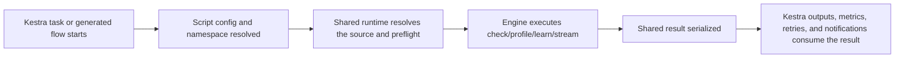

!!! note "Truthound Orchestration 한국어 문서"
    이 페이지는 Truthound 문서의 한국어 미러입니다. 코드, 명령어, API 이름은 정확성을 위해 원문 표기를 유지하고, 설명은 데이터 품질 워크플로우 관점으로 제공합니다.

---
title: Kestra Overview
---

# Truthound — Data Quality 워크플로우 for Kestra

Truthound's Kestra integration is YAML-first. It gives Kestra users Python helpers for
script tasks, generated flow templates, structured outputs, and SLA-aware execution
without asking them to abandon native Kestra flow design.

## Who This Is For

- teams orchestrating 데이터 품질 with Kestra flow YAML
- operators who prefer script-task execution over heavy embedded framework code
- platform engineers standardizing reusable flow templates

## When To Use It

Choose Kestra when:

- your team wants flow YAML to remain the primary control plane
- Python script tasks are already a normal part of the platform
- generated flow templates are preferable to hand-written repetitive 검증 jobs

## Prerequisites

- `truthound-오케스트레이션[kestra]` installed in the script execution environment
- a Kestra deployment with namespaces and task runners
- a supported URI, file, or relation-oriented 검증 source

## What The Package Provides

- script entry points such as `check_quality_script`
- reusable executor classes for check, stream, profile, and learn 워크플로우s
- flow generation helpers such as `generate_check_flow`
- output handlers for Kestra-friendly result emission
- SLA monitoring hooks and presets

## Minimal Quickstart

```python
from truthound_kestra import check_quality_script

result = check_quality_script(
    data_uri="s3://warehouse/curated/users.parquet",
    rules=[
        {"column": "id", "check": "not_null"},
        {"column": "email", "check": "email_format"},
    ],
)
```

Generate a reusable flow template when the pattern should be standardized:

```python
from truthound_kestra import generate_check_flow, RetryConfig

yaml_content = generate_check_flow(
    flow_id="users_quality",
    namespace="production",
    retry=RetryConfig(max_attempts=3),
)
```

## Decision Table

| Need | Recommended Kestra Surface | Why |
|------|----------------------------|-----|
| execute a one-off quality script | `check_quality_script` | easiest task-level entry point |
| standardize repeated flow structure | `generate_check_flow` or related template helpers | keeps YAML generation consistent |
| publish structured outputs | `KestraOutputHandler` or `send_check_result` | aligns with Kestra output conventions |
| separate environments or teams | namespace-aware flow config | keeps ownership explicit |

## Execution Lifecycle



## Result Surface

- script helpers return shared Truthound results
- Kestra output handlers translate them into task outputs and metrics
- downstream flows should consume the structured output contract instead of parsing logs

## Config Surface

| Config Area | Kestra Boundary |
|-------------|-----------------|
| 검증 input | URI, file, or task output passed into the script |
| runtime behavior | script config and retry config |
| environment ownership | namespace and Kestra variables/secrets |
| output contract | output handlers and task outputs |

## Recommended Reading Order

- [Scripts and Flow Templates](scripts-templates.md)
- [Outputs and Metrics](outputs-metrics.md)
- [Input and Output Files](input-output-files.md)
- [Task Runners and Retries](task-runner-retries.md)
- [Namespaces and Secrets](namespace-secrets.md)
- [Recipes](recipes.md)
- [Troubleshooting](troubleshooting.md)
