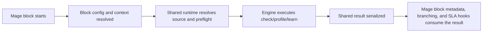

!!! note "Truthound Orchestration 한국어 문서"
    이 페이지는 Truthound 문서의 한국어 미러입니다. 코드, 명령어, API 이름은 정확성을 위해 원문 표기를 유지하고, 설명은 데이터 품질 워크플로우 관점으로 제공합니다.

---
title: Mage Overview
---

# Truthound — Data Quality 워크플로우 for Mage

Truthound's Mage integration is designed for teams that want pipeline-native data
quality blocks without introducing a separate 오케스트레이션 control plane. The package
leans on Mage conventions such as transformers, sensors, conditions, and `io_config`
discovery instead of forcing a custom runtime model.

## Who This Is For

- Mage teams building pipeline-local quality checks
- platform engineers standardizing data source discovery and output handling
- operators who want SLA-aware gating inside Mage blocks

## When To Use Mage

Choose Mage when:

- 검증 belongs directly in pipeline blocks
- your team already relies on Mage project conventions such as `io_config.yaml`
- you want a simple handoff from raw extract to quality gate to downstream load

Choose Airflow, Dagster, or Prefect when you need richer scheduler semantics, broader
deployment control, or host-native 오케스트레이션 abstractions.

## Prerequisites

- `truthound-오케스트레이션[mage]` installed
- a Mage project with pipeline blocks and project config
- a supported source shape for the shared runtime

## What The Package Provides

- transformers for check, profile, and learn 워크플로우s
- sensor and condition blocks for gate-style branching
- `io_config.yaml` discovery and source normalization
- shared runtime preflight, observability, and serialization behavior
- SLA monitoring hooks and presets

## Minimal Quickstart

```python
from truthound_mage import CheckBlockConfig, CheckTransformer

transformer = CheckTransformer(
    config=CheckBlockConfig(
        rules=[
            {"column": "id", "check": "not_null"},
            {"column": "email", "check": "email_format"},
        ]
    )
)

result = transformer.execute(dataframe)
```

Gate a later step with a condition or sensor when needed:

```python
from truthound_mage import DataQualityCondition
```

## Decision Table

| Need | Recommended Mage Surface | Why |
|------|--------------------------|-----|
| active 검증 step | transformer block | best fit for pipeline-local execution |
| pass/fail or branch logic | condition block | keeps branching explicit |
| wait/gate semantics | sensor block | separates readiness from execution |
| project-scoped source discovery | `io_config.yaml` and loader utilities | stays native to Mage projects |

## Execution Lifecycle



## Result Surface

- transformers, sensors, and conditions all rely on the same shared result semantics
- Mage-specific wrappers add block metadata and control-flow meaning without redefining the quality result itself
- rollout decisions should consume the serialized result, not just block success/failure

## Config Surface

| Config Area | Mage Boundary |
|-------------|---------------|
| 검증 rules | block config |
| runtime metadata | `BlockExecutionContext` |
| source config | `io_config.yaml` and project profile selection |
| alerting/SLA | shared hooks and Mage integration points |

## Production Pattern

The most maintainable Mage layout is:

- extract or load data with the project's normal Mage loaders
- run `CheckTransformer` or `ProfileTransformer` in a dedicated transformer block
- gate downstream work with `DataQualitySensor` or `DataQualityCondition`
- source connection details from `io_config.yaml` or environment-backed values
- enable SLA hooks for operator visibility

## Shared Runtime Behavior

Mage inherits the same shared runtime guarantees as the other adapters:

- source resolution rules
- preflight compatibility checks
- normalized result serialization
- observability and resilience helpers

Start with:

- [Shared Runtime Overview](../common/index.md)
- [Source Resolution](../common/source-resolution.md)
- [Observability and Resilience](../common/observability-resilience.md)

## Production Checklist

- isolate 검증 into dedicated transformer blocks
- keep branching logic in condition or sensor blocks
- standardize `io_config.yaml` profile usage across environments
- add SLA hooks before broad production rollout

## Failure Modes and Troubleshooting

| Symptom | Likely Cause | What To Do |
|--------|--------------|------------|
| quality behavior differs by pipeline | block config and context are inconsistent | standardize shared block patterns |
| secrets leak into committed project config | runtime values live in `io_config.yaml` instead of secret-backed inputs | move secrets out of committed config |
| incident response is slow | results exist but are not surfaced through hooks or gates | add condition/sensor and SLA wiring |

## Recommended Reading Order

- [Project Layout](project-layout.md)
- [Block Types and Runtime Context](block-runtime-context.md)
- [`io_config.yaml`](io-config.md)
- [Variables, Secrets, and Profiles](variables-secrets.md)
- [Recipes](recipes.md)
- [Production Rollout](production-rollout.md)
- [Troubleshooting](troubleshooting.md)
